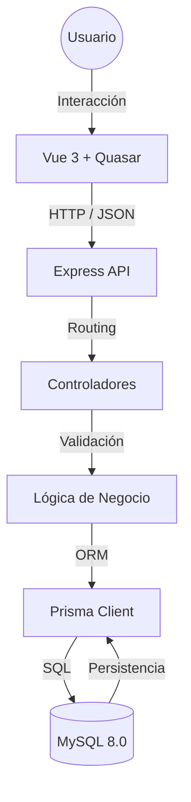

# 🏥 Consultorio

---

## ¿Qué es este proyecto?

**Consultorio** es una aplicación web que permite gestionar información clínica de manera ordenada y segura.

A nivel técnico, el proyecto demuestra:

* Uso de **arquitectura limpia por capas**.
* Separación clara de responsabilidades.
* Uso de **Docker** para eliminar dependencias locales.
* Buenas prácticas de desarrollo backend y frontend.
* Uso de principios SOLID.

> 💡 **Objetivo:** Que cualquier persona pueda levantar el proyecto con un solo comando, sin instalar Node.js, MySQL o dependencias adicionales.

---

## Tecnologías Utilizadas

El proyecto utiliza el stack **MEVN**, ampliamente usado en aplicaciones modernas:

### Frontend

* **Vue.js 3** (Composition API)
* **Quasar Framework**
* **TypeScript**

### Backend

* **Node.js**
* **Express.js**

### Base de Datos

* **MySQL 8.0**
* **Prisma ORM** (tipado fuerte, migraciones y seguridad)

### Infraestructura

* **Docker**
* **Docker Compose**

---

## Requisitos Previos

Para ejecutar el proyecto **solo necesitas**:

1. **Docker Desktop**
   👉 [https://www.docker.com/products/docker-desktop/](https://www.docker.com/products/docker-desktop/)
2. **Git** (opcional, solo si deseas clonar el repositorio)

> ⚠️ **Importante:**
>
> * NO necesitas instalar Node.js
> * NO necesitas instalar MySQL
> * NO necesitas XAMPP
> * Docker se encarga absolutamente de todo

---

## Arquitectura del Sistema

El sistema sigue una **Arquitectura de Capas (Layered Architecture)**, lo que permite:

* Escalabilidad
* Mantenimiento sencillo
* Código limpio y desacoplado



---

## Descripción de las Capas

### Capa de Presentación (Frontend)

**Tecnologías:** Vue 3 + Quasar

**Responsabilidades:**

* Renderizar la interfaz de usuario
* Manejo de estado reactivo
* Captura y validación básica de datos

**Comunicación:**

* Consume la API REST mediante **Axios**
* Uso de interceptores para manejo de errores

---

### Capa de Controlador (Backend Entry)

**Tecnología:** Express.js

**Responsabilidades:**

* Recibir peticiones HTTP
* Validar parámetros y body
* Retornar respuestas HTTP correctas (200, 400, 500)

---

### Capa de Lógica de Negocio (Service Layer)

**Responsabilidades:**

* Contener toda la lógica del sistema
* Reglas de negocio
* Orquestación de operaciones

> ✔️ Esto evita lógica innecesaria en controladores y frontend.

---

### Capa de Acceso a Datos

**Tecnología:** Prisma ORM

**Responsabilidades:**

* Abstraer consultas SQL
* Acceso tipado y seguro a la base de datos
* Migraciones controladas

---

## Patrones de Diseño Aplicados

Para cumplir estándares profesionales de ingeniería de software:

### Modelo-Vista-Controlador (MVC)

* **Model:** Prisma Schema
* **View:** Vue + Quasar
* **Controller:** Express Controllers

---

### Objeto de transferencia de datos (DTO)

Uso de interfaces TypeScript como:

* `PatientInput`
* `Patient`

Beneficios:

* Contratos claros entre frontend y backend
* Prevención de errores en tiempo de compilación

---

### Borrado Lógico (Soft Delete)

En lugar de eliminar registros:

* Se actualiza el campo `deletedAt`

Beneficios:

* Conservación del historial médico
* Auditoría y recuperación de datos

---

### Patrón de capa de servicio

La lógica HTTP se encapsula en servicios:

* `PatientService.ts`

Esto mantiene:

* Componentes Vue limpios
* Código más mantenible y testeable

---

## Instrucciones de Instalación

### 1️⃣ Clonar o Descargar el Proyecto

Clona el repositorio o descarga el ZIP en tu computadora.

---

### 2️⃣ Iniciar la Aplicación

Desde la carpeta raíz del proyecto, ejecuta:

```bash
docker-compose up --build
```

Docker se encargará de:

* Construir imágenes
* Crear contenedores
* Levantar frontend, backend y base de datos

---

### 3️⃣ Accesos

Una vez finalizado el proceso:

* **Frontend:** [http://localhost:9000](http://localhost:9000)
* **API Backend:** [http://localhost:3000](http://localhost:3000)

---

## Acceso a Base de Datos (Opcional)

Puedes conectarte manualmente usando herramientas como:

* MySQL Workbench
* DBeaver
* DataGrip

**Credenciales:**

* Host: `localhost`
* Puerto: `3306`
* Usuario: `root`
* Contraseña: `root`
* Base de datos: `consultorio`

---

## Solución de Problemas Comunes

### Error: `Bind for 0.0.0.0:3306 failed: port is already allocated`

**Causa:**

* MySQL o XAMPP corriendo localmente

**Solución:**

* Detén MySQL local
* Cierra XAMPP
* Vuelve a ejecutar Docker

---

### Error: `P1001: Can't reach database server`

**Causa:**

* El backend inicia antes que MySQL

**Solución:**

* Espera 10 segundos
* El backend se reinicia automáticamente

✔️ Comportamiento esperado la primera vez

---

### Error: `Docker Desktop failed to start`

**Solución:**

* Habilitar virtualización en BIOS
* Activar WSL 2 en Windows
* Reiniciar Docker Desktop

---
